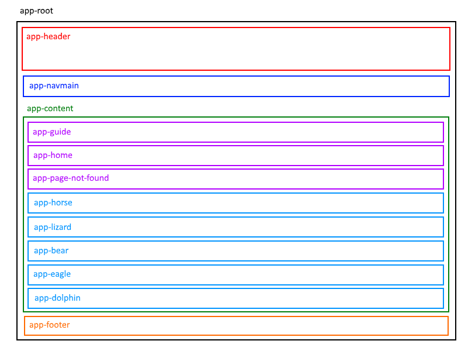

## Angular components example

> This document is being edited.

> This notice will be removed when the edits are complete.

In this document, you will create an app with several components. 

The goal is to become comfortable with the idea of components, and the process of creating and displaying them. 

<br>

### Getting started, new project

Visualize  
Draw a quick diagram  
Here's what we're trying to do...  



<br>

#### Generate a new project  

WITH routing! (even though we will not configure routing until next week; adding routing when a new project is created is a best practice)  

`ng new animals --routing -st`

The `--routing` option adds the code we need for "routing", which is a topic that will be covered in detail next week. 

The `-st` option does not add "testing" code. One of the effects is that it reduces the size of the project, and perhaps makes it a bit faster in the change detection and build processes.

<br>

**Optional - reduce the project size even further**

If you want to reduce the size of the project even further, we can add one more option to the "ng new" command:

`ng new animals --minimal --routing -st`

The `--minimal` option does this. However, it has a side effect that we will not like, so if you do choose this option, please make one change to eliminate the side effect. How?

Open, for editing, the project's `.angular-cli.json` configuration file. 

Change the value of the `inlineStyle` and `inlineTemplate` properties to `false`. 

<br>

#### Create structural components

Create structural components:
* Header
* Navigation (named "NavMain")
* Main content (named "Content")
* Secondary content (named "Guide")
* Footer

This is done with Angular CLI commands:

```text
ng g c header --flat
ng g c navmain --flat
ng g c content --flat
ng g c guide --flat
ng g c footer --flat
```

<br>

#### Create components to support routing

Create components to support routing:
* Home (a home or start page)
* Page not found (named "PageNotFound")

This is done with Angular CLI commands:

```text
ng g c home --flat
ng g c PageNotFound --flat
```

Notice the use of CamelCase on the "PageNotFound" name. The Angular CLI will parse that, and make the component's file name assets use lower case, with dash separators between the words. Nice. 

<br> 

#### Create components to hold content

Create components to hold content; we'll use an *animals* theme:
* Horse
* Lizard
* Bear
* Eagle
* Dolphin

This is done with Angular CLI commands:

```text
ng g c horse --flat
ng g c lizard --flat
ng g c bear --flat
ng g c eagle --flat
ng g c dolphin --flat
```

<br>

> ( more to come )

<br>