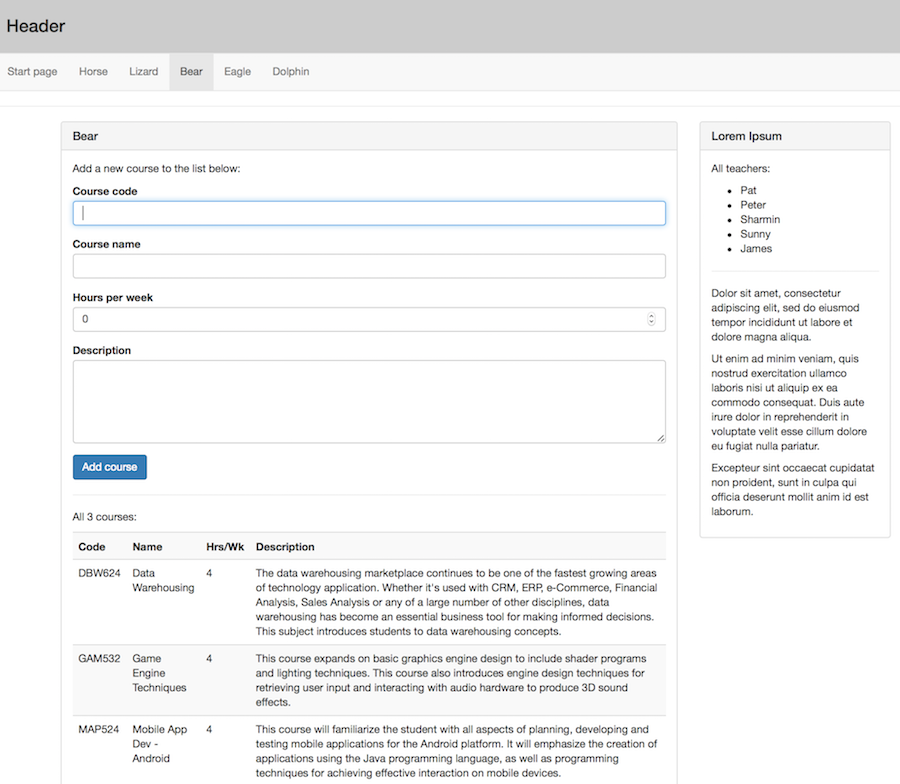

## Angular forms example

In this document, you will learn how to add forms to an app. 

Before doing that, we want to make sure that you can easily and comfortably reproduce and test the code examples that you see in the official documentation and even on help venues like Stack Overflow. 

 

### Documentation examples, and testing them

The documentation is filled with code snippets and code examples. Some are fully-running and fully-completed apps. Others are not - just snippets. 

It is a good idea to know how to easily use and test the code, without alot of time, effort, and hassle. Here's a sequence that you can follow to do this (or any other Angular dev task in the future).

The first few steps are familiar. The last few seem like common sense, but if you haven't done them yet, you must get some experience. Go ahead and try.

Using Angular CLI, generate a new project:  
`ng new Testing --routing -sg -st`

(For more information on the flags for the 'ng new' command, see: [https://github.com/angular/angular-cli/wiki/new#options](https://github.com/angular/angular-cli/wiki/new#options)

In Terminal, navigate to the project's folder.

Open the project in Visual Studio Code:  
`code .`

In Terminal, build and run the project:  
`ng serve --open`

In the browser, show the JavaScript console dev tool.

In VS Code, open these two source code files for editing:
* `app.component.ts`
* `app.component.html`

From a code example, copy-paste code to the appropriate location, replacing existing code. Save the changes, and then switch to the browser to see and test the result.

The key to this is the *appropriate location*. For example, some code examples have an inline HTML template. Copy only the HTML from that, into your `app.component.html` source code file. 

  

### Getting started with forms

Fetch the week 9 code example from [the course's GitHub code repository](https://github.com/sictweb/web422). 

Using Terminal, open the `week9` folder. Then, run the `npm update` command to refresh the modules. 

Open the project for editing. Remember the quick-and-easy way to do this:  
`code .` 

Then, you can build and run the app with this:  
`ng serve --open`. 

 

#### Forms processing scenario

In the code example, the "Bear" component has been edited. Its content has been pushed down. It has a list (table) of academic courses. It also has a form that enables the user to add a new course. 

 

First, the data model: A "BearModel" class has been defined, in the `bear-model.ts` source code file. It's a simple model, with a few properties.

Now, look at the component class:  
`bear.component.ts`

It declares an array (collection) of type BearModel (name is `courses` plural), and then makes some in-memory objects when the component loads for the first time. 

It declares a view model, also of type BearModel (name is `course` singular). This is used by the form. It doesn't have any data, but it could. 

The component class also has a function `onSubmit` that will handle the post back from the form. As you can see, it assumes the data coming back is OK, and it just gets added to the `courses` array/collection. Which is then automatically displayed in the list of courses. Cool. 

The HTML template is unexciting. It includes the required features we learned this week (form tag attributes, two-way data binding, etc.). 

 

**Summary**

From this, you can probably see how we can build more complex user interaction scenarios. We hope to get to some of those in the next week or so. 

 
