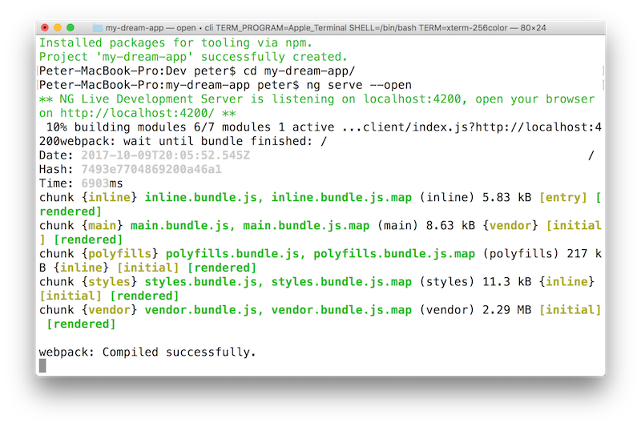
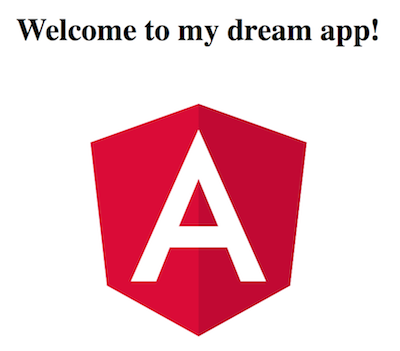
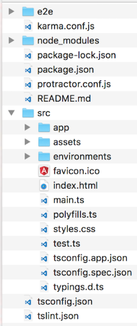

## Getting started with Angular

The next part of our learning journey will depend on the excellent content that the Angular development team has published. 

Get ready by visiting the [Angular home page](https://angular.io/), and read/scan the following content:
* Landing page
* FEATURES page
* The DOCS landing page

<br>

### Installation

As described in the GETTING STARTED installation notes, Angular is installed by using the Node Package Manager. 

During the React topic coverage, you learned to install and use the *React app generator*. As you experienced, it adds a good amount of value to the dev process.

Angular has an app generator too, the [Angular CLI](https://cli.angular.io/). 


<br>

Install Angular CLI on your computer:

```text
npm install -g @angular/cli
```

<br>

### Create an app

Next, create a new app. Assuming that you want to create a new app (and folder) named "my-dream-app":

```text
ng new my-dream-app
```

> Note: "ng" is an Angular command.

The process will create a new folder, with the code needed to get started.

<br>

### Run the app

An Angular app is a client-side front-end app. It does NOT have a server part to it. A browser user "pulls" an Angular app, by visiting a URL that is the "root" of the app. As you will learn later, the packaging and deployment process creates a bundle of files that are sent to the browser when the root of the app is requested for the first time. 

That being said, all Angular developers - you included now - will start an on-demand per-instance Node.js server, and listen on the app's URL. Then, from a browser, the app is pulled to the browser's memory, and is ready for use. 

Therefore, start the server listener:

```text
cd my-dream-app
ng serve
```

The server begins listening on HTTP port 4200. Open a browser to the [localhost port 4200 URL](http://localhost:4200/). 

> Alternatively...  
> You can start the server listener, *and* open a web browser, with one command:  
> `ng serve --open`



<br>

### Edit the app

Start Visual Studio Code. Open the "my-dream-app" folder. 

Alternatively, you can use the command line. However, as you probably noticed in your Terminal window, the on-demand web server is blocking it from further interaction. So, open a new Terminal window (Shell > New Window). Then you can make "my-app" your current folder, and run the `code .` command (**Note**: this option requires you to have added 'code' to your PATH - see: [https://code.visualstudio.com/docs/setup/mac](https://code.visualstudio.com/docs/setup/mac)). 

An easy edit, just to prove that you can do so, is to edit the `app.component.ts` file in the `src/app` folder. Change the text in the value of the "title" property. 

After you save your changes, switch over to the browser window. It should show the new content. Behind the scenes, the Terminal process will regenerate the content, making changes where necessary to the deployment assets. As part of the process, the browser will refresh the visible content.



<br>

### Work through some documentation topics

Return to the [GETTING STARTED](https://angular.io/guide/quickstart) documentation topic. 

In the instructions above, we have taken you through the first few screenfuls. Now it's time to read/scan the remaining content on this page. 

Take your time. While you are doing this, inspect the source code in your editor (Visual Studio Code). 

Here are some of the highlights that you should be looking for:
* The code for your app lives in the `src` folder
* The generator creates a `src/app` folder, with code assets for the "app" component
* Later (but soon), we will use the Angular CLI to create another component in the `src` folder
* There are a number of files and folders that perform specific tasks for the app, and/or help you as the programmer



<br>

### What's next?

There are some documents that can help you understand more about the Angular way to build an app.

The official [Angular tutorial](https://angular.io/tutorial) is a recommended skim/read, and you may or may not want to code along with it. 

> We recommend that you develop locally on your own computer (and not do the live online process). 

The other is from the Visual Studio Code documentation set, titled [Using Angular in VS Code](https://code.visualstudio.com/docs/nodejs/angular-tutorial). It's a reasonably short document. One of its very useful topics is the how-to for debugging Angular in VS Code. 

Happy coding!

<br>
