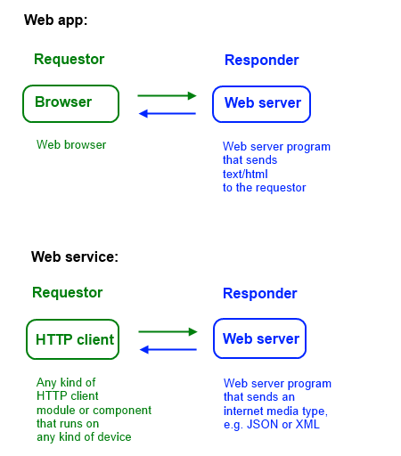
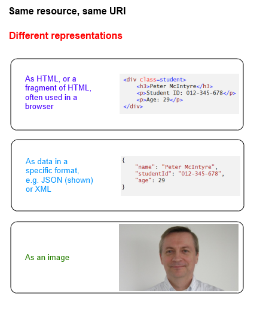

## Web services (re)introduction

Sketch out (or describe) the goal:
* Understand use case
* Roles of requester (client) and responder (server)
* JSON, and XmlHttpRequest

> Come back and edit this part.

 

### What is a web service?

**A web service is an application that runs on a web server, and is accessed programmatically.**

When we parse this short sentence, and consider the meanings behind the simple words, we reveal some very important concepts:

* HTTP is the protocol, enabling wide use and scalability
* Humans don't use a web service directly - instead, the *application they are using* creates and sends a request to the web service, and handles the response in a way that's meaningful to the application 
* A web service's functionality is discoverable, and typically known as an application programming interface (API)

Web services can be developed on any web-connected technology platform, in any language, and can be used on any kind of device.

 

### What's the difference between a *web app*, and a *web service*?

Study this diagram to understand the differences, and then be prepared to explain them to someone else:

 

 

### Give me a brief history lesson on web services

With the rise of the web's use and popularity in the 1990s, efforts were made to define and specify web services.

This led to the *de facto* standardization of [SOAP XML web services](https://en.wikipedia.org/wiki/SOAP). Often described as "big web services", or "legacy web services", SOAP XML web services are the implementation of [remote procedure calls](https://en.wikipedia.org/wiki/Remote_procedure_call) on the web. This kind of web service typically has one specific endpoint address, and requestors must create and send a data package (which conforms to a data format named SOAP), and then process the response (which also conforms to SOAP).

However, other efforts took advantage of the web and its existing features and benefits. In other words, they simply followed the [HTTP specification](https://tools.ietf.org/html/rfc7230) and its *ex post facto* architecture definition, to create true and pure web services. These kinds of web services, often termed "Web API", "RESTful web services", or "HTTP services", exploded in use and popularity from about 2005 onwards, and are now the preferred design approach.

 

### Are web services important?

Yes.

Absolutely.

Web services are *vital* for modern software architectures.

For *all* device platforms. 

 

### How do I learn to create web services?

In the previous web programming course, you got started with this task in the [Week 9 coverage](http://zenit.senecac.on.ca/~patrick.crawford/index.php/web322/course-notes/week9-class1/) (Ajax Review / Practical Ajax Programming). 

In addition, you used an easily-accessed public web service, [reqres.in](https://reqres.in). 

Let's step back for a moment, and identify the topics that a web service programmer needs to cover and acquire:
* A thorough understanding of the requester (client) and responder (server) interaction and message-passing model
* Fundamentals of the HTTP protocol, including request methods, message headers, message bodies, resources, representations (media types), and responses (status, contents)
* The JSON media type (and a little about the XML media type)

Returning to the knowledge and skills that you gained in the previous web programming course, you can map to the list above:
* Your requestor was a JavaScript XmlHttpRequest object that was running in a browser
* Your responder was a Node+Express web app that was running in a server
* You learned some fundamentals of the HTTP protocol, including using the GET and POST methods, as well as learning (and maybe using) other methods (PUT, DELETE, OPTIONS)
* You also learned about responses from the server, and what to do when an HTTP 200 response comes back (update the DOM with the response content!)
* You worked with JSON as the media type for the data in your requests and responses

 

**Web services development and deployment environment**

You will continue to use the frameworks and tools from the previous web programming course:
* Node.js
* Express.js
* MongoDB
* Visual Studio Code
* Unix-like (macOS or Linux) development and execution environment

Each web service that you create will be treated as a *separate and distinct* program. It will be concerned only with listening then responding to requests that come in. 

During development, you will use an *HTTP inspector* app, like [Postman](https://www.getpostman.com/), to create and send requests to a web service. 

> [Postman how-to article](https://www.sitepoint.com/master-api-workflow-postman/)

Then, you will be creating *separate* web app *clients*, which send requests to your web service. 

Each program can be individually and separately deployed to any device platform that meets your needs.

 

### Terminology

As your web programming competency grows, it is important to know and be able to correctly use some common web programming terms.

 

**Web app, and web service** 

If you create a server-based program, and it is intended to be used mostly by web browsers, we typically call that a *web app*. 

Alternatively, if you create a server-based program, and it is intended to be used programmatically (by iOS and Android apps, or by JavaScript in a browser, or by an "HTTP client" module in a native Windows, macOS, or Linux app, we typically call that a *web service*. 

 

**Resource**

A resource is a digital asset.

Familiar examples include a document, or an image.

How do you identify a resource? By using its URI (uniform resource identifier). The URI standard is described in [RFC 3986](https://tools.ietf.org/html/rfc3986), and also in a [Wikipedia article](https://en.wikipedia.org/wiki/Uniform_Resource_Identifier).

What is the format, or representation, of the resource? Well, it depends on the design of the web service, and sometimes the needs of the requestor.

 

**Representation**

As defined above, a resource is a digital asset.

A representation is a digital asset that is formatted as a specific internet media type.

Think about a scenario where a web service was used to manage students in a course. Each student is a resource - a digital asset - that can be identified by a URI.

If a user requested a specific resource through a web browser, you would expect that the resource would be *represented* by some HTML that included the student's name, student ID, and so on.

Alternatively, it's also possible to request the same specific resource - using the same URI - but also specify that it be returned in a data format (like JSON or XML, discussed later). The server will return a data *representation* of the resource.

Or, maybe the request specified that the student's photo be returned as the resource's *representation*. Again, the same URI is used.

So, in summary, a resource's representation can vary to meet the needs of the web service programmer or the web service user. The requestor and responder use a feature called [content negotiation](https://en.wikipedia.org/wiki/Content_negotiation) to make this happen.

Every representation is defined by an internet media type.

 

**Internet media type**

An *internet media type* is defined as a *data format* for a *representation* of a *resource* on the internet.

The data formats are standardized, [published](https://www.iana.org/assignments/media-types/media-types.xhtml), and well-known, by the IANA (the Internet Assigned Numbers Authority).

[This Wikipedia article](https://en.wikipedia.org/wiki/Media_type) is an acceptable introduction to internet media types.

For web service programmers, two important internet media types are used as data formats, [JSON](https://en.wikipedia.org/wiki/JSON) and [XML](https://en.wikipedia.org/wiki/XML).

Both are plain-text data formats. They are somewhat human-readable.

Later, you will probably learn how to work with non-text media types. From now on, we will typically work with plain-text JSON.

 

**State**

> TBA - the following is a brain dump - will be updated

state transition

reading the current state of a resource, or  
changing the current state  
this is *state transfer*

we work with a *representation* of a *resource*  
so, when we're reading or changing...  
we are transferring, from one app to another, a representation of the state of a resource  
hence, REST

ta da

roy fielding

parts of a web server...  
TCP/IP stack  
http listener
runtime, execution environment for static and dynamic requests
logger
file system
persistent store manager

state management...  
server has a data store to persist resources (state persistence, permanent)  
in HTTP, every request is atomic  

server's request-handling process: GET static resource
1. server receives a request for a resource
2. if the request is for a static resource that's in the file system, the server simply locates and fetches the resource
3. assemble the response, which includes metadata and the representation of the resource, and then send the response
4. log the fact that the request-response happened
5. return to listening mode

request-handling process: GET dynamically-generated resource
1. server receives a request for a resource
2. load the program code that does the dynamic generation
3. assemble the response, which includes metadata and the representation of the resource, and then send the response
4. unload the code that dynamically generated the resource
5. log the fact that the request-response happened
6. return to listening mode

the main point is that the server effectively treats every request as separate / discrete / atomic, and DOES NOT actively maintain any notion of a continual logical session

in other words, no state maintenance or state management at the server

this runs counter to a fimilar message-passing activity we as people do... a face-to-face or voice telephone conversation, in which each person in this kind of interactive information exchange maintains state naturally; each can easily recall what was said a few moments ago, and build upon that 

maybe define what a "session" is when used in a networked app context

if the state of a (message exchange) session is important to maintain, it's done by the requester

old web apps did more of this at the server, but scale is a problem  
new web apps are designed for fast networks and fast client execution platforms (browsers or native like iOS or Android)

shopping cart, bad direct analogy, because it's a hybrid  
anonymous shopping is stateless  
but if you're authenticated, the server will use that to create a shopping cart that's persisted in the data store 
the server's MEMORY (active request-serving process) is not maintaining the shopping cart state in this situation  
it's in the database  

 

**REST**

Now we can circle back to REST. 

**RE**presentational **S**tate **T**ransfer

 

### TBA

let's get back to...

In the previous web programming course, you got started with this task in the [Week 9 coverage](http://zenit.senecac.on.ca/~patrick.crawford/index.php/web322/course-notes/week9-class1/) (Ajax Review / Practical Ajax Programming). 

REST is an architectural style for designing networked apps

remember curl

hmmm... in part of the course, use a public api
* youtube
* github
* instagram
* etc.

would be a good/efficient way to begin learning about auth too

