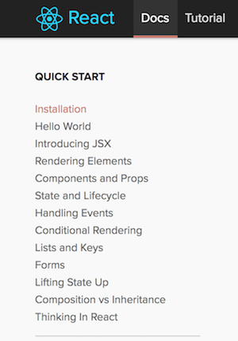

## Getting started with React

The next part of our learning journey will depend almost completely on the excellent content that the React development team has published. 

Get ready by visiting the [React home page](https://facebook.github.io/react/), and read/scan the content.

On the top navigation menu, notice the [Docs](https://facebook.github.io/react/docs/installation.html) (documentation) and [Tutorial](https://facebook.github.io/react/tutorial/tutorial.html) items. 



<br>

### Installation

As described in the [Docs](https://facebook.github.io/react/docs/installation.html) installation notes, React is installed by using the Node Package Manager. 

For best results, use the React app generator. Install it on your computer:

```text
npm install -g create-react-app
```

<br>

### Create an app

Next, create a new app. Assuming that you want to create a new app (and folder) named "my-app":

```text
create-react-app my-app
```

The process will create a new folder, with the code needed to get started.

<br>

### Run the app

A React app is a client-side front-end app. It does NOT have a server part to it. A browser user "pulls" a React app, by visiting a URL that is the "root" of the app. As you will learn later, the packaging and deployment process creates a bundle of files that are sent to the browser when the root of the app is requested for the first time. 

That being said, all React developers - you included now - will [start](https://docs.npmjs.com/cli/start) an on-demand per-instance Node.js server, and listen on the app's URL. Then, from a browser, the app is pulled to the browser's memory, and is ready for use. 

Therefore, start the server listener:

```text
npm start
```

The server begins listening on HTTP port 3000. Depending on your computer's configuration, it may automatically open a browser to the [localhost port 3000 URL](http://localhost:3000/). 

<br>

### Edit the app

Start Visual Studio Code. Open the "my-app" folder. 

Alternatively, you can use the command line. However, as you probably noticed in your Terminal window, the on-demand web server is blocking it from further interaction. So, open a new Terminal window (Shell > New Window). Then you can make "my-app" your current folder, and run the `code .` command. 

An easy edit, just to prove that you can do so, is to edit the `App.js` file in the `src` folder. Change the text in the HTML h2 element. After you save your changes, switch over to the browser window. It should show the new content. Behind the scenes, the Terminal process will regenerate the content, making changes where necessary to the deployment assets. As part of the process, the browser will refresh the visible content.

<br>

### Work through several topics

At the top of this document we noted that the next part of our learning journey will depend almost completely on the excellent content that the React development team has published. 

Therefore, spend a few hours (before, during, and after class) to go through these topics:

[Installation](https://facebook.github.io/react/docs/installation.html)  
[Hello World](https://facebook.github.io/react/docs/hello-world.html)  
[Introducing JSX](https://facebook.github.io/react/docs/introducing-jsx.html)  
[Rendering Elements](https://facebook.github.io/react/docs/rendering-elements.html)  
[Components and Props](https://facebook.github.io/react/docs/components-and-props.html)  
[State and Lifecycle](https://facebook.github.io/react/docs/state-and-lifecycle.html)  
[Handling Events](https://facebook.github.io/react/docs/handling-events.html)  

<br>

### What's next?

There are three more documents that can help you understand more about the React way to build an app.

The first is the `README.md` that the React generator creates. As it states near the top of that file, you can find the most recent version of this guide [here](https://github.com/facebookincubator/create-react-app/blob/master/packages/react-scripts/template/README.md). Surprisingly, there are many nuggets that give you hints about the app design and deployment process. Most will be beyond your need during this short two-week treatment of React, but many of the themes will be reused when we begin working with Angular (and you never know, you may end up working with React in the future). 

Another is the official [React tutorial](https://facebook.github.io/react/tutorial/tutorial.html). It's a recommended skim/read, and you may or may not want to code along with it.

The other is from the Visual Studio Code documentation set, titled [Using React in VS Code](https://code.visualstudio.com/docs/nodejs/reactjs-tutorial). It's a reasonably short document. One of its very useful topics is the how-to for debugging React in VS Code. 

Happy coding!
